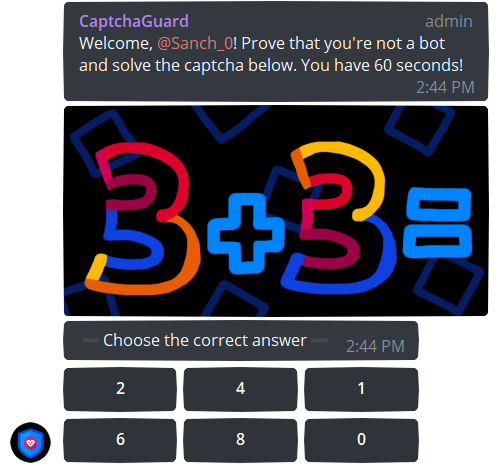
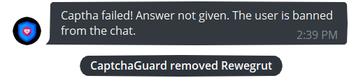
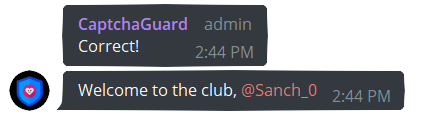

 

  
  <h3 align="center">CapthaGuard bot</h3>
   

      A captha bot to secure public chats from suspicious users
         
      
         
      <a href="#how-it-works">How it Works</a>
      ·
      <a href="#features">Features</a>
      ·
      <a href="#report-bug">Report Bug</a>
    

 

## How it Works
  

      CaptchaGuard is an easy-to-use bot for public chats. The bot sends simple mathematical captcha to check if a new member of a chat is a bot. It is designed the way that real person would complete it quite easily. Some examples of the captcha: 
      

        
        
        
        
      

         
     When a new member joins the chat, CapthaBot sends a query like this one: 
     
     If a new member happens to be a spam account, he won't respond correctly. The user who failed to solve the captcha or ignored it counts as a bot and gets removed from the chat by CaptchaGuard. 
     
     The user who solved the captcha correctly counts as a human. This member is now verified and can start chatting! They also get a greeting message if it was set by chat admin. 
     
  

 
## Features
<ul>
  <li>Currently available translations:
    <ul>
      <li>Currently available translations:</li> 
    </ul>
  </li> 
</ul>

## Report Bug
