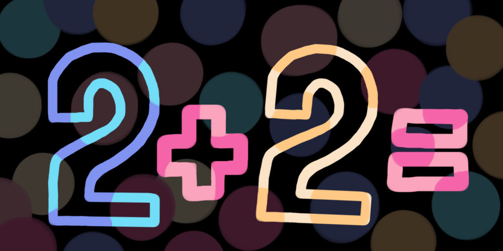
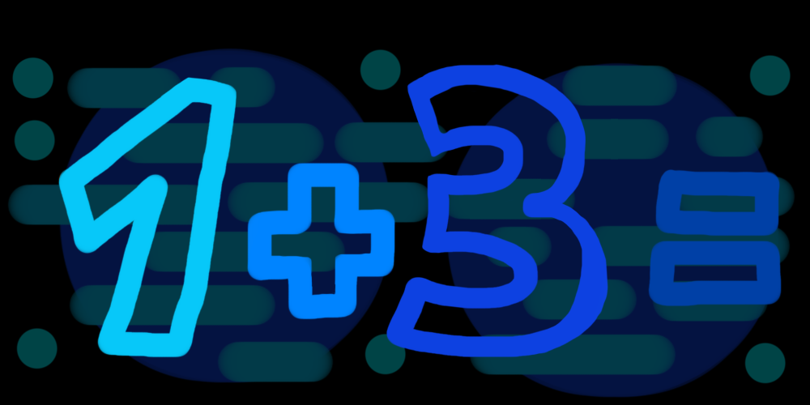

 

  
  <h3 align="center">CaptchaGuard bot</h3>
   

      A captha bot to secure public chats from suspicious users
         
      
         
      <a href="#how-it-works">How it Works</a>
      ·
      <a href="#features">Features</a>
      ·
      <a href="https://github.com/stegogo/CaptchaGuard-bot/issues">Report Bug</a>
    

 

## How it Works

  

      CaptchaGuard is an easy-to-use bot for public chats. The bot sends a simple mathematical captcha to check if a new member of a chat is a bot. It is designed the way that a real person would complete it quite easily. Some examples of the captcha: 
      

        
        
        
        
      

         
     
When a new member joins the chat, CapthaBot sends a query like this one:

     

      
     
If a new member happens to be a spam account, he won't respond correctly.  The user who failed to solve the captcha or ignored it counts as a bot and gets removed from the chat by CaptchaGuard.

      

      
     
The user who solved the captcha correctly, counts as a human.  This member is now verified and can start chatting!  They also get a greeting message if it was set by chat admin.

     

      
  

 
## Features

<ul>
  <li>20+ unique captcha images with shuffled answers
  <li>Customizable greeting message for new members
  <li>Currently available translations:
    <ul>
      <li>🇬🇧 English</li>
      <li>🇺🇦 Ukrainian</li>
      <li>🇷🇺 Russian</li>
    </ul>
  </li>
  <li>More features coming soon!
</ul>
